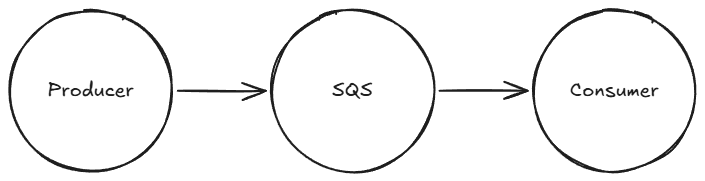
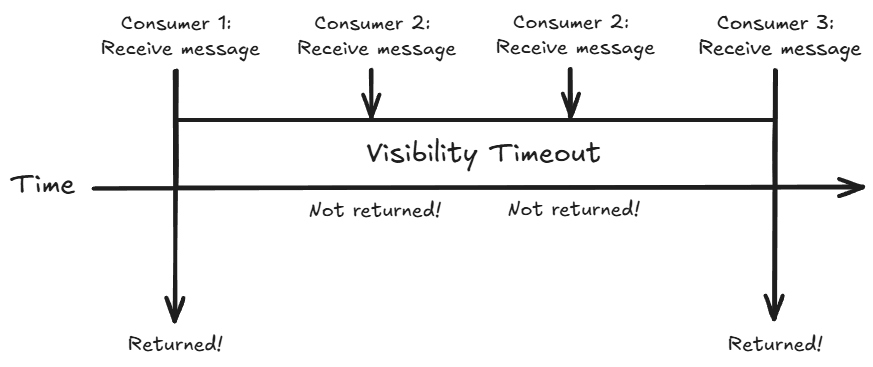

# Understanding AWS SQS Visibility Timeout

SQS is a useful building block for distributed systems because it decouples producers from consumers.

Let's take a simple example of one producer sending a message to the queue and one consumer consuming the message.

The message stays in the queue until a consumer receives it. But receiving a message does not immediately remove it from the queue.

The consumer has to explicitly delete the message once the processing has succeeded. This is to prevent loss of messages either in transit or by errors during processing.

A consumer can take time to process messages, in some cases, hours!

So how does SQS prevent multiple consumers trying to process the message at the same time?

That's where the visibility timeout comes in.

## Message Visibility Timeout

When a consumer is processing a message, the message goes into a hidden state from other available consumers. No other consumer can attempt to process the message during this period.

The hidden state has a duration. The message becomes available to other consumers after the duration has finished and the original consumer did not delete the message from the queue.

We can configure the visibility duration on a per queue or per message basis.

Let's see how that looks.

## Example

Here's a quick rundown of what's happening in the diagram. We are assuming the message processing did not succeed in this example.

1. Consumer 1 attempts to receive the message, it is returned and begins processing.

2. Consumer 2 attempts to receive the message, it is in the hidden state, so it is not returned.

3. Consumer 2 attempts to receive the message again, it is still in the hidden state so it is not returned.

4. Consumer 3 attempts to receive the message, the visibility period is over and the message is still in the queue. The message is returned and Consumer 3 begins processing.

## Optimal Configuration

Typically we configure the visibility timeout on a per queue basis. This means all messages will have the same timeout in seconds.

In some situations, this isn't so straightforward.

Let's say during processing of the message, it needs additional time for whatever reason. In situations like this, we can rely on the `ChangeMessageVisibility` SQS API. This allows the consumer to change the visibility timeout on a per message basis.

The consumer can make an API call to change the visibility timeout of the message it's currently processing. This would immediately change the visibility timeout period and ensure it's not visible to other consumers.

## Best Practices

Setting the visibility timeout period depends on your processing time.

The best strategy I have found is to set the visibility timeout to the maximum time it takes your consumers to process each message.

This ensures that every message is given enough time to process and allows for retrying when things go wrong.

If you don't know the processing time, set it to a baseline value and keep extending the visibility period via the `ChangeMessageVisibility` API until the message is processed.